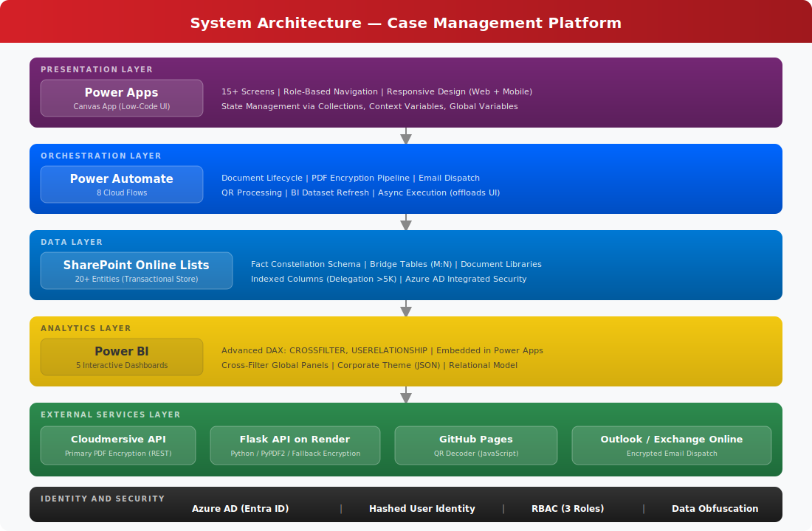
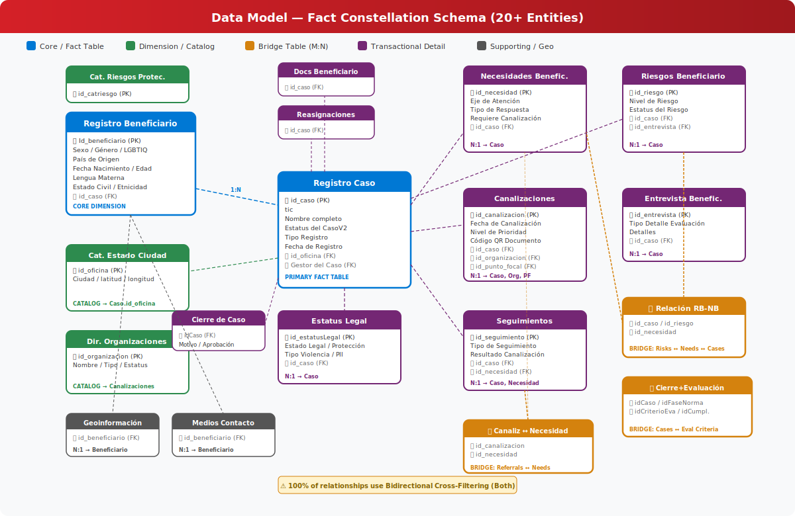
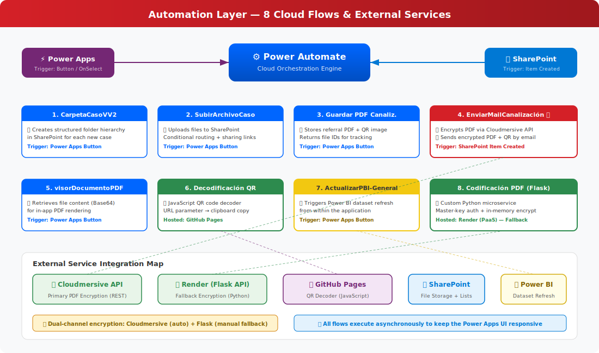
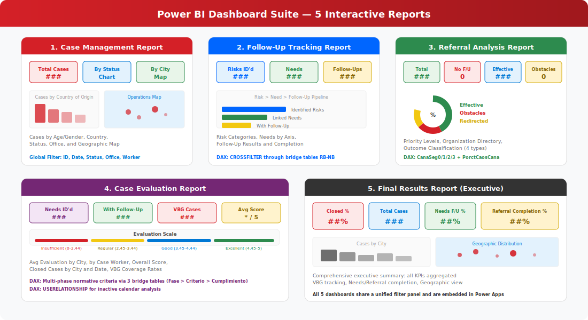

# 🏛️ Case Management Platform — Save the Children México


> **Enterprise Architecture Case Study** — End-to-end design and delivery of a secure, cloud-native case management system for one of the world's largest child-rights organizations, operating across multiple field offices in Mexico.

---

## Table of Contents

- [Executive Summary](#executive-summary)
- [The Challenge](#the-challenge)
- [My Role](#my-role)
- [Solution Architecture](#solution-architecture)
- [Technology Stack](#technology-stack)
- [Data Model](#data-model)
- [Automation Layer](#automation-layer)
- [Security & Access Control](#security--access-control)
- [Business Intelligence Layer](#business-intelligence-layer)
- [Application Screens & UX](#application-screens--ux)
- [Impact & Results](#impact--results)
- [Lessons Learned](#lessons-learned)
- [Repository Structure](#repository-structure)

---

## Executive Summary

Save the Children México required a comprehensive digital platform to manage the full lifecycle of child protection cases — from initial registration and risk assessment through referrals, follow-ups, evaluations, and case closure — across geographically distributed field offices. The solution needed to comply with strict personal data protection standards while remaining accessible to non-technical field staff operating in challenging environments.

I designed and delivered an **end-to-end integrated system** combining Microsoft Power Platform (Power Apps, Power Automate, Power BI), SharePoint Online as a lightweight transactional backend, and custom external microservices for document encryption. The platform centralizes operations that were previously fragmented across spreadsheets, email chains, and local files into a single, role-based, real-time application.

---

## The Challenge

### Before: Fragmented Operations with Critical Data Gaps

Prior to this initiative, field teams managed child protection case data using a patchwork of **disconnected spreadsheets, local files, and manual email-based workflows**. This created several operational risks:

- **Data Fragmentation** — Case information was scattered across Excel files, shared drives, and individual devices. There was no single source of truth for case status, beneficiary data, or referral outcomes.
- **Manual Bottlenecks** — Every document handoff (referral letters, encrypted PDFs, QR-coded case files) required manual intervention, consuming hours of operational time that should have been spent on direct child protection work.
- **Compliance Exposure** — Sensitive personal data of minors (biodata, legal status, risk assessments) lacked systematic encryption, access control, and audit trails, putting the organization at regulatory and ethical risk.
- **Zero Real-Time Visibility** — Leadership had no consolidated view of case volumes, referral effectiveness, follow-up completion rates, or geographic distribution of operations. Reporting was reactive, not strategic.
- **Scalability Ceiling** — As programs expanded to new territories and offices, the manual approach could not scale without proportionally increasing administrative overhead.

### The Mandate

Build a secure, automated, and centralized platform that field workers could use on any device, with role-based access, end-to-end document encryption, real-time dashboards, and full compliance with personal data protection standards — all within the organization's existing Microsoft 365 licensing footprint.

---

## My Role

**IT Project Manager & Technical Architecture Lead**

I owned this project end-to-end: from initial stakeholder discovery and requirements gathering, through architecture design, data modeling, development, testing, deployment, and documentation.

**Key responsibilities included:**

- Conducting stakeholder interviews with field staff, protection officers, and program directors to map the case management lifecycle and identify pain points.
- Designing the complete system architecture spanning four Microsoft Power Platform services plus external APIs and custom microservices.
- Engineering a 20+ entity relational data model on SharePoint Lists with bridge tables to resolve complex many-to-many relationships.
- Building 15+ application screens in Power Apps (Canvas) covering case registration, biodata, risk interviews, referrals, follow-ups, evaluations, and case closure.
- Developing 8 Power Automate flows for document management, PDF encryption, email dispatch, QR code processing, and Power BI dataset refresh orchestration.
- Creating a custom Flask (Python) microservice deployed on Render as a fallback PDF encryption API with master-key authentication.
- Designing 5 interactive Power BI dashboards (Case Management, Follow-Up Tracking, Referral Analysis, Case Evaluation, Final Results) with advanced DAX measures.
- Authoring a role-based security model integrated with Azure Active Directory (Microsoft Entra ID) with phone-number obfuscation and hashed user identity controls.
- Writing comprehensive technical documentation (the full system documentation spans 7 chapters).

---

## Solution Architecture

### High-Level Architecture Diagram



*[Insert Architecture Diagram Here — Replace with your own block diagram if preferred]*

### Architecture Overview

The system follows a **layered cloud-native architecture** built entirely on the Microsoft 365 ecosystem, extended with surgical external integrations for capabilities not natively available:

```
┌──────────────────────────────────────────────────────────────────┐
│                      PRESENTATION LAYER                          │
│         Power Apps (Canvas) — Multi-platform UI                  │
│     15+ Screens │ Role-Based Navigation │ Responsive Design      │
├──────────────────────────────────────────────────────────────────┤
│                    ORCHESTRATION LAYER                            │
│              Power Automate — 8 Cloud Flows                      │
│  Document Mgmt │ Email Dispatch │ PDF Encryption │ BI Refresh    │
├──────────────────────────────────────────────────────────────────┤
│                       DATA LAYER                                 │
│           SharePoint Online Lists — 20+ Entities                 │
│     Transactional Store │ Document Libraries │ Catalogs          │
├──────────────────────────────────────────────────────────────────┤
│                    ANALYTICS LAYER                                │
│          Power BI — 5 Interactive Dashboards                     │
│     DAX Measures │ Embedded in Power Apps │ Cross-Filter Model   │
├──────────────────────────────────────────────────────────────────┤
│                  EXTERNAL SERVICES LAYER                         │
│   Cloudmersive API │ Render (Flask API) │ GitHub Pages (QR)      │
│     PDF Encryption │ Fallback Encryption │ QR Decoder UI         │
└──────────────────────────────────────────────────────────────────┘
│                    IDENTITY & SECURITY                            │
│        Azure AD (Entra ID) │ Hashed User Control │ RBAC          │
└──────────────────────────────────────────────────────────────────┘
```

### Component Breakdown

| Layer | Component | Purpose |
|:------|:----------|:--------|
| **Presentation** | Power Apps (Canvas) | Low-code UI with absolute layout control, corporate branding, multi-platform execution (web + mobile) |
| **Data Store** | SharePoint Online Lists | Structured cloud storage supporting up to 30M items per list, with native Azure AD integration and document attachment support |
| **Automation** | Power Automate | Cloud-based orchestration engine handling file operations, API calls, email dispatch, and asynchronous processing to offload heavy logic from the UI |
| **Analytics** | Power BI | Business intelligence layer transforming raw SharePoint data into interactive dashboards with relational modeling and DAX-powered KPIs |
| **Encryption (Primary)** | Cloudmersive API | Automated, in-flow PDF encryption via REST connector integrated into Power Automate pipelines |
| **Encryption (Fallback)** | Custom Flask API on Render | Self-hosted Python microservice (PyPDF2) providing organization-owned encryption with master-key authentication, independent of third-party API rate limits |
| **QR Processing** | GitHub Pages (JavaScript) | Static web app that decodes URL-parameter-based QR codes to display case referral passwords to authorized users |

---

## Technology Stack

### Core Platform

| Technology | Role | Details |
|:-----------|:-----|:--------|
| **Microsoft Power Apps** | Frontend (Canvas App) | 15+ screens with state management via collections, context variables, and global variables. Gallery-based case directories with dynamic filtering. |
| **SharePoint Online** | Backend / Data Store | 20+ lists acting as a lightweight transactional database with indexed columns for delegation optimization beyond the 5,000-record threshold. |
| **Power Automate** | Process Orchestration | 8 cloud flows handling document lifecycle, encryption pipelines, email automation, and BI refresh triggers. |
| **Power BI** | Business Intelligence | 5 dashboards with Fact Constellation schema, bridge tables, advanced DAX (CROSSFILTER, USERELATIONSHIP), and embedded rendering inside Power Apps. |

### External Services & Custom Code

| Technology | Role | Details |
|:-----------|:-----|:--------|
| **Python / Flask** | Microservice API | Custom PDF encryption service deployed on Render with master-key authentication, PyPDF2 for in-memory document processing. |
| **JavaScript / HTML** | QR Decoder UI | GitHub-hosted static web application for URL-parameter-based QR code resolution with clipboard integration. |
| **Cloudmersive API** | Document Security | REST-based PDF encryption integrated via HTTP connectors in Power Automate for the primary automated encryption pipeline. |
| **Azure Active Directory** | Identity & Access | User authentication via Microsoft Entra ID, Claims-based identity resolution (`Office365.MyProfile().Id`), and role mapping. |
| **DAX** | Analytics Language | Complex measures using context modifiers (CROSSFILTER), virtual calendar relationships (USERELATIONSHIP), and operational KPIs for case tracking. |

---

## Data Model

### Entity-Relationship Overview

The semantic model follows a **Fact Constellation** (multi-fact) schema adapted for Power BI, centered around the full lifecycle of child protection cases.



*[Insert ER Diagram Here — Replace with your own diagram if preferred]*

### Core Entities (The Three Pillars)

The entire data model revolves around three foundational tables:

1. **Registro Caso** (Case Registry) — The primary fact table. Nearly every other transactional table relates directly or indirectly to this entity. Contains case ID, registration type, beneficiary pattern, assigned case worker, status, and office location.

2. **Registro Beneficiario** (Beneficiary Registry) — Central dimension holding demographic data (gender, age, nationality, ethnicity, marital status, language, sexual orientation) linked 1:N to cases.

3. **Necesidades Beneficiario & Riesgos Beneficiario** (Needs & Risks) — Branching capture tables that justify operational interventions such as referrals and follow-ups.

### Relationship Architecture

The model implements **20+ explicit relationships** with bidirectional cross-filtering across virtually 100% of declared relationships. Complex many-to-many cardinalities are resolved through purpose-built **bridge tables**:

| Bridge Table | Resolves | Purpose |
|:-------------|:---------|:--------|
| `Relación RB-NB` | Risks ↔ Needs ↔ Cases | Central pivot mapping risk assessments to identified needs at the case level |
| `Relacion Canaliz - Neced` | Referrals ↔ Needs | Links each organizational referral to the specific needs it addresses |
| `Cierre de Caso y Evaluación` | Cases ↔ Evaluation Phases ↔ Criteria ↔ Compliance | Standardizes multi-criteria case closure evaluation under a single case ID |

### Entity Inventory (20+ Tables)

**Transactional / Fact Tables:** Registro Caso, Registro Beneficiario, Canalizaciones (Referrals), Seguimientos (Follow-Ups), Riesgos Beneficiario, Necesidades Beneficiario, Entrevista Beneficiario, Estatus Legal, Documentos Beneficiario, Reasignaciones, Cierre de Caso, Cierre de Caso y Evaluación.

**Dimension / Catalog Tables:** Catálogo Estado Ciudad, Catálogo Ejes y Tipos de Atención, Riesgo de Protección a la Infancia, Directorio de Organizaciones, Directorio de Puntos Focales, Criterios Evaluación, Evaluación Fase-Norma, Evaluación - Cumplimiento a La Norma, Proyectos, Proyecto_Ciudad, Calendario.

**Geospatial & Contact Tables:** Geoinformación (addresses, residency type, country/state/city), Medios de Contacto (phone, email, WhatsApp, contact hours).

### DAX Intelligence Layer

The model includes sophisticated calculated columns and measures:

| Measure | Technique | Purpose |
|:--------|:----------|:--------|
| `Casos con Seguimiento` | `CROSSFILTER()` + Bridge Tables | Dynamically alters filter propagation across bridge tables to count cases that have received follow-up |
| `Riesgos por Fecha` / `Seguimientos por Fecha` | `USERELATIONSHIP()` | Activates inactive calendar relationships for time-based analysis without duplicating date tables |
| `PorctCaosCana` | Multi-measure composition | Calculates referral follow-up completion percentage across four outcome categories |
| `PorctCasosCerrados` | `FILTER()` + `COUNTROWS()` | Computes case closure rate as a real-time operational KPI |

---

## Automation Layer

### Power Automate Flows (8 Cloud Flows)

The orchestration layer handles all heavy processing asynchronously, keeping the Power Apps UI responsive.



*[Insert Automation Flow Diagram Here — Replace with your own diagram if preferred]*

| # | Flow Name | Trigger | Purpose |
|:--|:----------|:--------|:--------|
| 1 | **CarpetaCasoVV2** | Power Apps button | Creates a structured folder hierarchy in SharePoint for each new case (subfolders: Beneficiary Docs, Privacy Notice, Referrals, Photography, Screenshots) |
| 2 | **SubirArchivoCaso** | Power Apps button | Uploads files from the app to SharePoint, handles conditional routing (encrypted vs. unencrypted PDFs), generates sharing links, returns document IDs |
| 3 | **Guardar Archivo PDF Canalización** | Power Apps button | Stores referral PDF documents and QR code images in SharePoint, returns file identifiers for cross-referencing |
| 4 | **EnviarMailCanalización** | SharePoint item creation | Automatically encrypts referral PDFs via Cloudmersive API, updates SharePoint with the protected version, dispatches email with encrypted PDF + QR attachments |
| 5 | **visorDocumentoPDF** | Power Apps button | Retrieves file content from SharePoint by ID and returns it as Base64 to Power Apps for in-app PDF viewing |
| 6 | **Decodificación QR** | URL parameter (GitHub Pages) | JavaScript-based QR decoder hosted on GitHub that extracts and displays referral passwords from URL parameters |
| 7 | **ActualizarPBI-General** | Power Apps button | Triggers a Power BI dataset refresh from within the app, enabling real-time dashboard updates after data entry |
| 8 | **Codificación PDF (Servidor Manual)** | HTTP POST (Flask API) | Fallback encryption microservice — accepts PDF + password via web form with master-key authentication, returns encrypted file |

### Custom Flask Microservice (PDF Encryption Fallback)

A self-hosted Python API deployed on **Render** provides organization-owned encryption capability independent of third-party rate limits:

```
Endpoint:  POST /proteger-pdf
Auth:      Master key validation (server-side)
Stack:     Python 3 / Flask / PyPDF2 / BytesIO
Process:   Receive PDF → Validate auth → Clone pages in memory →
           Encrypt with user password → Return protected file →
           Purge from memory
```

This microservice serves as a **resilience layer**: if Cloudmersive reaches its API call limit, field staff can manually encrypt sensitive documents through the web UI without interrupting operations.

---

## Security & Access Control

### Multi-Layer Security Model

Security is enforced at every tier of the architecture:

```
┌─────────────────────────────────────────────┐
│  LAYER 1: Identity (Azure AD / Entra ID)    │
│  Claims-based authentication via Office 365  │
├─────────────────────────────────────────────┤
│  LAYER 2: Platform Permissions               │
│  SharePoint site access │ Power Apps sharing │
│  Power BI workspace roles                    │
├─────────────────────────────────────────────┤
│  LAYER 3: Application-Level RBAC             │
│  Role hash mapping │ UI visibility control   │
│  Feature gating per role                     │
├─────────────────────────────────────────────┤
│  LAYER 4: Data Obfuscation                   │
│  Phone number encoding │ Status code hashing │
│  PDF encryption (AES-grade)                  │
└─────────────────────────────────────────────┘
```

### Role-Based Access Control (RBAC)

User identity is resolved at app launch via `Office365Users.MyProfile().Id` and mapped against a SharePoint-based user registry:

| Role ID | Role Name | Hash Code | Access Scope |
|:--------|:----------|:----------|:-------------|
| GP-0001 | **Case Worker** (Gestor de Protección) | `2bbf88ff` | Case operations: registration, biodata, referrals, follow-ups. Limited to assigned cases and office. |
| OP-0002 | **Protection Officer** (Oficial de Protección) | `f5f6fcf3` | Supervisory access: cross-case visibility, risk review, case reassignment approval. |
| AA-0003 | **App Administrator** | `5e6b697d` | Full access: user management, catalog administration, project configuration, dashboard management. |

### Data Obfuscation

Contact phone numbers are protected using a **substitution cipher** applied at form submission:

```
Digit → Primary Filter → Encoded Value
  0   →      §0        →     q5
  1   →      §1        →     d2
  2   →      §2        →     g4
  ...
  9   →      §9        →     w3
```

User status codes are similarly encoded (`Activated: ksldo-2901-ls` / `Deactivated: lsoape-23nk-53l`) to prevent database-level inspection from revealing user states.

---

## Business Intelligence Layer

### Dashboard Suite (5 Reports)

Power BI dashboards are **embedded directly inside Power Apps** as interactive tiles, giving field staff and leadership a unified experience without switching applications.



*[Insert Dashboard Screenshot Here — Replace with your own screenshot if preferred]*

| Dashboard | Purpose | Key Visuals |
|:----------|:--------|:------------|
| **Case Management Report** | Operational overview of all active cases | Cases by Country of Origin, Cases by Status, Cases by Age & Gender, Geographic Map of Operations, Cases by City |
| **Follow-Up Tracking Report** | Monitors intervention completeness | Identified Risks by Category, Needs by Attention Axis, Follow-Up Results, Risk-Need-Follow-Up Pipeline |
| **Referral Analysis Report** | Tracks organizational referral effectiveness | Total Referrals, Referrals Without Follow-Up, Effective Referrals, Redirected/Unclosed Referrals, Priority Levels |
| **Case Evaluation Report** | Measures case quality at closure | Average Evaluation Score by City, by Case Worker, Overall Score, VBG Cases with/without Follow-Up, Scoring Scale (Insufficient → Excellent) |
| **Final Results Report** | Executive summary for leadership reporting | Closed Case %, Total Cases, Needs Identified vs. Followed-Up, VBG Coverage, Referral Completion %, Geographic Distribution |

### Cross-Filter Model

All dashboards share a **global filter panel** enabling drill-down by: Case ID, Registration Date Range, Case Status, Office, Case Worker, ID Type, Registration Type, and Legal Status.

---

## Application Screens & UX

### Screen Inventory (15+ Screens)

The Power Apps Canvas application covers the **complete case management lifecycle**:

| Phase | Screen | Functionality |
|:------|:-------|:-------------|
| **Intake** | `Home` | Role-based routing, welcome screen, admin menu visibility gating |
| **Intake** | `GC_Caso` | Case directory with search/filter + New Case registration (consent, demographics, privacy notice upload) |
| **Assessment** | `GC_Biodata` | Detailed beneficiary profile (gender, nationality, ethnicity, language, religion, civil status) |
| **Assessment** | `GC_Direcciones` | Geolocation data (country, state, city, street, postal code, residency type) |
| **Assessment** | `GC_MediosContacto` | Contact methods (phone, WhatsApp, email) with favorite/active flags |
| **Assessment** | `GC_EstatusLegal` | Legal status tracking (displacement intent, protection type, violence type, origin) |
| **Assessment** | `GC_EntrevistaRiesgos` | Risk interview with catalog-based risk classification |
| **Operations** | `GC_ExpedienteCaso` | Digital case file with document viewer (Base64 PDF rendering) |
| **Operations** | `GC_PlanAcción` | Action plan based on identified needs and risks |
| **Operations** | `GC_NuevaCanalizacion` | Referral wizard with organization directory, focal point lookup, PDF generation + QR code + encrypted email dispatch |
| **Operations** | `GC_Seguimiento` | Follow-up tracking with outcome classification (effective / obstacles / redirected) |
| **Operations** | `GC_Reasignaciones` | Case reassignment workflow between case workers and offices |
| **Closure** | `GC_EvaluacionCaso` | Multi-phase evaluation against normative criteria with scoring |
| **Closure** | `GC_CierreCaso` | Formal case closure with reason, observations, and supervisor approval |
| **Admin** | `Admin_GestionUsuarios` | User provisioning with role assignment, office mapping, and contact obfuscation |
| **Admin** | `Admin_CatalogoRiesgos` | Risk catalog CRUD (categories, subcategories, descriptions) |
| **Admin** | `Admin_Organizaciones` | Partner organization directory management |
| **Admin** | `Admin_Proyectos` | Project and territory configuration |
| **Analytics** | `Dashboard` | Embedded Power BI with real-time refresh trigger |

---

## Impact & Results

### Quantified Outcomes

| KPI | Result |
|:----|:-------|
| **Manual Processing Time** | Reduced by an estimated **60–70%** through automated folder creation, document encryption, email dispatch, and referral workflows |
| **Data Centralization** | **100%** of case data consolidated from scattered spreadsheets into a single, queryable platform |
| **Real-Time Visibility** | From **zero dashboards** to **5 interactive reports** embedded in the operational app, enabling data-driven decisions at every level |
| **Document Security** | **End-to-end PDF encryption** with dual-channel capability (automated Cloudmersive + manual Flask API fallback) for every sensitive referral |
| **Access Control** | **3-tier RBAC** with Azure AD integration, data obfuscation, and hashed identity controls — fully compliant with personal data protection standards |
| **Scalability** | Platform supports **30M+ records per list** with indexed-column delegation, ready to scale across new territories without architectural changes |
| **Deployment Scope** | Multi-office coverage across Mexico with responsive web + mobile access for field staff |
| **User Onboarding** | Non-technical field workers operating autonomously within the platform thanks to guided UX and role-based navigation |

### Strategic Value

- **For Field Teams:** Hours previously spent on manual data management are now available for direct child protection work.
- **For Leadership:** Real-time dashboards replaced quarterly manual reports, enabling proactive resource allocation and evidence-based advocacy.
- **For Compliance:** Systematic encryption, audit trails, and access controls establish a defensible data protection posture for sensitive minor data.
- **For IT:** Zero additional licensing cost — the entire solution runs on the organization's existing Microsoft 365 E3/E5 footprint.

---

## Lessons Learned

1. **SharePoint Lists as a backend** work remarkably well for transactional workloads when you invest in proper indexing and delegation-aware query patterns. The 5,000-record delegation threshold is a design constraint, not a blocker.

2. **Bidirectional cross-filtering** is powerful but should be used with intention. As the data model grew, I began selectively managing filter direction via DAX `CROSSFILTER()` rather than relying on the model-level `Both` setting — a practice I'd adopt from the start in future projects.

3. **Fallback architecture matters.** The custom Flask encryption API on Render wasn't just a nice-to-have — it prevented operational disruptions when the primary Cloudmersive API hit rate limits during peak referral periods.

4. **Bridge tables are essential** in Power BI when modeling humanitarian case management data. The many-to-many relationships between risks, needs, referrals, and follow-ups cannot be flattened without losing analytical fidelity.

5. **Phone number obfuscation at the application layer** adds a meaningful defense-in-depth layer, even when the underlying platform (SharePoint) has its own access controls.

---

## Repository Structure

```
├── README.md                          # This file
├── docs/
│   ├── architecture-diagram.svg       # High-level system architecture
│   ├── data-model-diagram.svg         # Entity-relationship diagram
│   ├── automation-flows.svg           # Power Automate flow map
│   ├── dashboard-preview.svg          # Power BI dashboard preview
│   └── screenshots/                   # Application screen captures
│       ├── home-screen.png
│       ├── case-directory.png
│       ├── referral-wizard.png
│       ├── dashboard-embedded.png
│       └── ...
├── microservices/
│   └── pdf-encryption/
│       ├── app.py                     # Flask API for PDF encryption
│       ├── requirements.txt
│       └── templates/
│           └── index.html
└── qr-decoder/
    └── qrview.html                    # QR code decoder (GitHub Pages)
```

---

## Contact

**Daniel Almazán**
IT Project Manager | Technical Architecture Lead | Systems Integration Specialist

> *Designed, built, and documented end-to-end. From stakeholder interviews to DAX measures, from Flask microservices to field-staff training — this project represents the full spectrum of systems integration delivery.*

---

<p align="center">
  <i>This case study was written for portfolio purposes. Sensitive data, credentials, and internal URLs referenced in the original documentation have been redacted or anonymized.</i>
</p>
